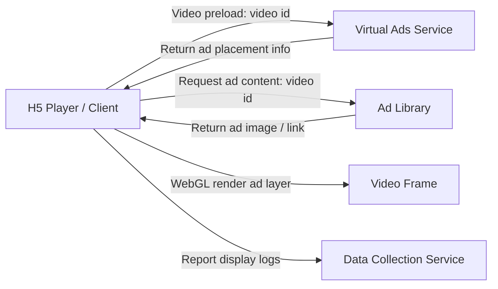
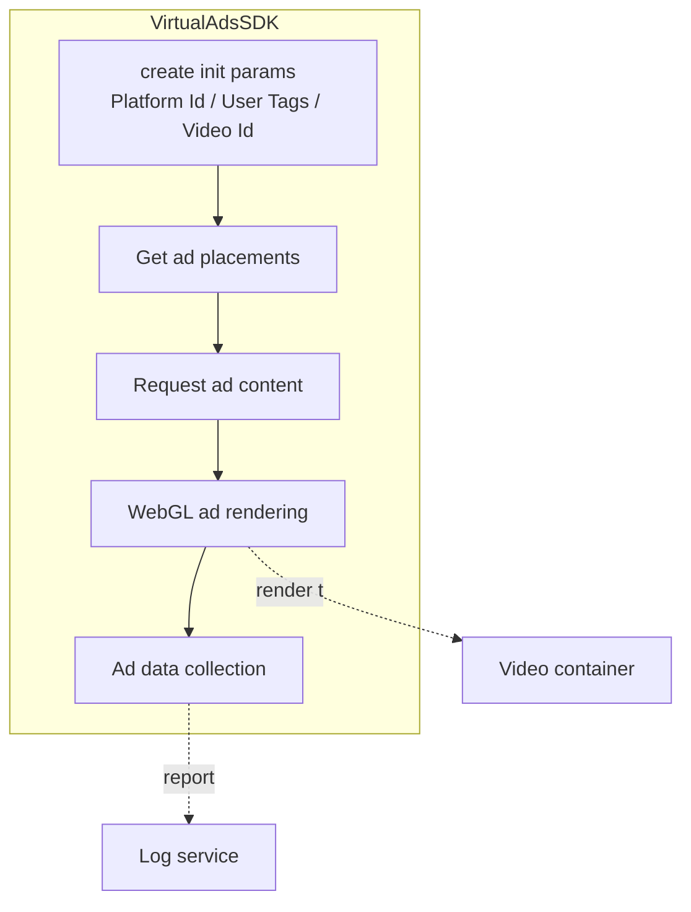
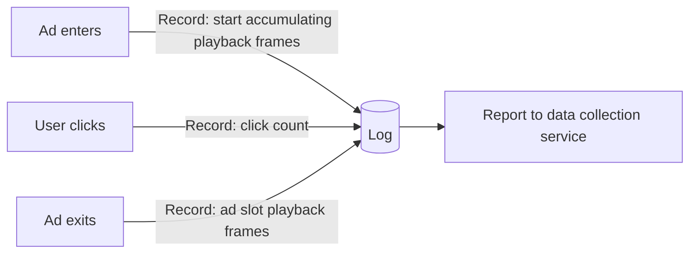

# Virtual Ads Player SDK Integration Guide — H5 Edition

> Microsoft Virtual Ads Team

## Document Overview

This document mainly describes how to integrate the Microsoft Virtual Ads (VA) player component with a Web page.

Further reading:

- *VA for Videos User Manual*
- *Virtual Ads API Development Guide*

---

## 1 VA Player Component Overview

To facilitate the integration of Virtual Ads with client-side players, the VA team encapsulates the relevant core logic into an independent **VA player component**, which currently supports integration with H5 players.

### 1.1 The Component Consists of Four Parts

| Module                     | Description                                                                                                                                                                                                             |
| -------------------------- | --------------------------------------------------------------------------------------------------------------------------------------------------------------------------------------------------------------------- |
| **Get Ad Placements**      | During the video preloading phase, the client sends a request to VA. Based on the video id in the request, VA determines whether the video has been preprocessed, and if so, returns the ad placement information contained in that video. |
| **Request Ad Content**     | The VA team provides an ad library; materials only take effect after being reviewed and confirmed by the partner. During video preloading, the client requests ad content (ad images, ad links, etc.). The ad library returns appropriate content based on the video id and renders it at a specific time and position. |
| **Ad Rendering Logic**     | Renders ad images onto the video interface via **WebGL**.                                                                                                                                                              |
| **Ad Data Collection**     | Only records ad display behavior; it is not tied to specific users.                                                                                                                                                    |

**Log fields recorded by ad data collection:**

- Number of ad playback frames
- Number of clicks (provided on demand)

### 1.2 Introduction to Core Feature Implementation

> The following diagrams are drawn based on the logic described in this document, for reference and understanding only.

**① VA Player Component Workflow Diagram**

**② VA Player Component Internal Logic Diagram**

**③ Data Logging Flow**

### 1.3 Development Environment Requirements

- **Text editor / IDE:** Visual Studio Code (rich in extensions and plugins)
- **Web browser:** Google Chrome (powerful developer tools)

> Note: You may choose development and testing tools according to your personal development preferences.

---

## 2 Integration Development Guide

This document only covers how to integrate the VA component with an H5 player.

### 2.1 Integration Development Workflow

Include the virtual ads processing script (`virtual-ads-sdk.js`) in the web page, and complete ad enhancement of the video content through configuration parameters to achieve the loading, display, and interaction of virtual ads. The overall process is divided into three main steps:

#### 2.2.1 Include the Core Script Module

Use a standard HTML `<script>` tag to include the core logic file `va.js` of the virtual ads system in the current page.

This module encapsulates the virtual ads processing class **`VirtualAdsSDK`**, which is used to identify ad placement points in the video content and render interactive ad layers.

#### 2.2.2 Create and Embed a Video Container

Create a video container in the page and embed the video.

#### 2.2.3 Initialize the Virtual Ads Processor and Configure Parameters

Call the `VirtualAdsSDK.create()` method directly within a function to inject business parameters (such as **Platform Id, User Tags, Video Id**) before the virtual ads module loads, completing module initialization and runtime environment preparation.

> **Note:**
>
> - The platform configures and transmits **user tags** such as geography, gender, age, and interests as parameters, which are used for campaign creation in VA Fusion to meet advertisers' personalized delivery needs for different audiences.
> - The **Platform Id** is received via email when a platform account is created on VA Fusion.

To reuse the integration process across multiple pages or platforms, you only need to adjust business parameters such as the video resource URL, user information, and platform ID according to the actual situation, enabling rapid deployment of a video-based virtual ads solution.

---

## 3 Player Verification Guide

### 3.1 Fusion Operation Guide

#### 3.2.1 Log in to Fusion and Upload Video

1. Click **Video Library** in the left navigation bar, then click **Upload** on the right to open the dialog.
2. First click **Download Template** to download the Excel form, fill it in following the example, then click **Upload** to submit. Microsoft will download the video media for processing based on the information in this form.

#### 3.2.2 Ad Slot Review

After the video processing is complete, the platform will receive an email notification. Log in to Fusion to complete the ad slot review:

1. Click **Ad Slot Management** on the left, and select the corresponding video content to view the ad slots.
2. When dynamically browsing the ad slots, click the **selected** button on the right to disable that ad slot.
3. After browsing and operating on all ad slots, click **Approve** at the bottom right to complete the ad slot review.
4. After that, wait for Microsoft to create a test Campaign.

#### 3.2.3 Ad Material Review

After Microsoft creates and publishes the test Campaign, the platform will receive a notification email to review the ad materials:

1. Log in to Fusion, click **Ad Placement Management** on the left, and select the corresponding video to review the ad images.
2. Quickly browse all ad slot images through static preview.
3. Click **Preview all in Video** at the top right to enter dynamic preview, watch the full video and browse the ad images, and click the delete button on an image to take non-compliant images offline.
4. After confirming all images, click **Approve** at the bottom right to complete the compliance review.

#### 3.2.4 Verify Display Effect

The test Campaign will be delivered on the scheduled date. The platform can view and verify the VA display effect on the H5 player.

---

## Version Statement

This document is the latest version as of **July 03, 2026**, and may be updated and revised in the future. For the latest version or any comments and suggestions, please contact the Microsoft Virtual Ads Team.
