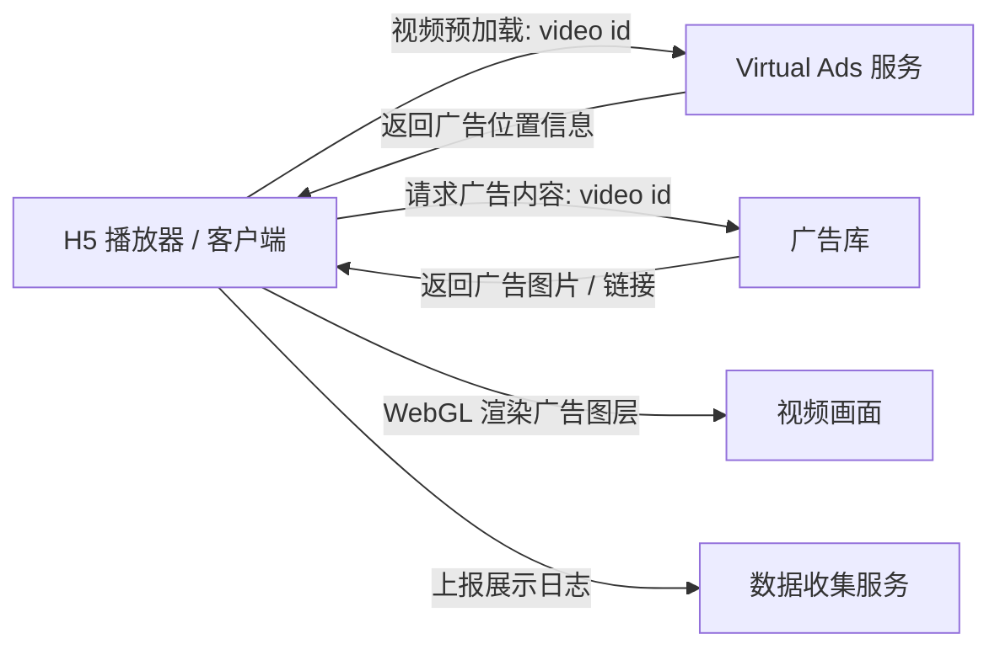
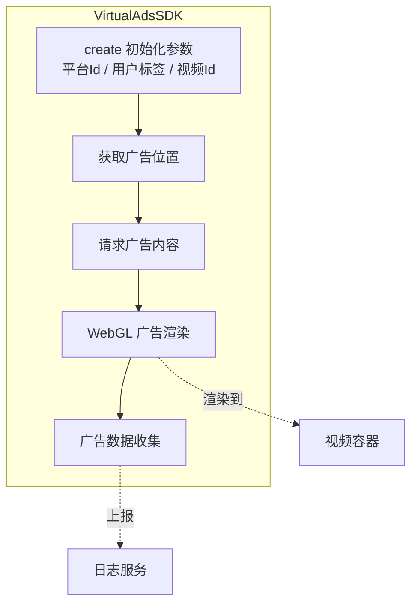
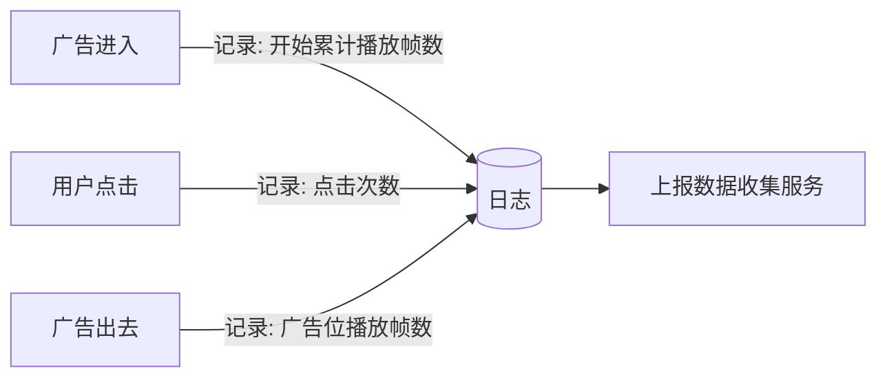

# Virtual Ads 播放器 SDK 集成指引 — H5 版

> 微软虚拟广告团队 · Microsoft Virtual Ads Team

## 文档说明

本文档主要介绍如何将微软虚拟广告（Virtual Ads，简称 VA）播放器组件与 Web 页面进行集成。

延伸阅读：

- 《VA for Videos 用户手册》
- 《Virtual Ads 接口开发指南》

---

## 1 VA 播放器组件概览

为方便 Virtual Ads 与客户端播放器的集成，VA 团队将相关核心逻辑封装成独立的 **VA 播放器组件**，目前已支持与 H5 播放器集成。

### 1.1 组件由四个部分组成

| 模块             | 说明                                                                                                                                                                          |
| ---------------- | ----------------------------------------------------------------------------------------------------------------------------------------------------------------------------- |
| **获取广告位置** | 视频预加载阶段，客户端向 VA 发送请求；VA 依据请求中的 video id 判断视频是否经过预处理，若是则返回该视频包含的广告位置信息。                                                   |
| **请求广告内容** | VA 团队提供广告库，素材需合作方审核确认后才正式生效。客户端在视频预加载时请求广告内容（广告图片、广告链接等），广告库依据 video id 返回合适内容，并在特定时间、特定位置渲染。 |
| **广告渲染逻辑** | 通过 **WebGL** 将广告图片渲染到视频界面。                                                                                                                                     |
| **广告数据收集** | 只记录广告展示行为，不与具体用户绑定。                                                                                                                                        |

**广告数据收集记录的日志字段：**

- 广告播放帧数
- 点击次数（根据需求提供）

### 1.2 核心功能实现简介

> 以下示意图依据文档描述的逻辑绘制，供理解参考。

**① VA 播放器组件工作示意图**

**② VA 播放器组件内部逻辑图**

**③ 数据日志记录流程**

### 1.3 开发环境要求

- **文本编辑器 / IDE：** Visual Studio Code（扩展和插件丰富）
- **Web 浏览器：** Google Chrome（开发者工具强大）

> 注：可根据个人开发习惯选择开发工具和测试工具。

---

## 2 集成开发指南

本文档仅针对如何将 VA 组件和 H5 播放器进行集成。

### 2.1 集成开发流程

在网页中引入虚拟广告处理脚本（`virtual-ads-sdk.js`），通过配置参数完成对视频内容的广告增强，实现虚拟广告的加载、展示与交互。整体分为三个主要步骤：

#### 2.2.1 引入核心脚本模块

通过标准 HTML `<script>` 标签，将虚拟广告系统的核心逻辑文件 `va.js` 引入当前页面。

该模块封装了虚拟广告处理类 **`VirtualAdsSDK`**，用于识别视频内容中的广告投放点位并渲染交互式广告图层。

#### 2.2.2 创建并嵌入视频容器

在页面中创建视频容器并嵌入视频。

#### 2.2.3 初始化虚拟广告处理器并配置参数

在函数中直接调用 `VirtualAdsSDK.create()` 方法，在虚拟广告模块加载前注入业务参数（如**平台 Id、用户标签、视频 Id**），完成模块初始化和运行环境准备。

> **注：**
>
> - 平台方将地理、性别、年龄、兴趣爱好等**用户标签**进行参数配置传输，用于 VA Fusion 的 campaign 创建，满足广告主针对不同人群的个性化投放需求。
> - **平台 Id** 在 VA Fusion 上创建平台账号时通过邮件查收。

如需在多个页面或平台复用集成流程，仅需根据实际情况调整视频资源地址、用户信息与平台 ID 等业务参数，即可快速部署基于视频的虚拟广告解决方案。

---

## 3 播放器验证指南

### 3.1 Fusion 操作指南

#### 3.2.1 登录 Fusion 上传视频

1. 点击左侧导航栏 **Video Library**，再点击右侧 **Upload**，进入弹出框。
2. 先点击 **Download Template** 下载 Excel 表单，按示例填写后点击 **Upload** 上传。微软将通过此表单信息下载视频介质进行处理。

#### 3.2.2 广告位审核

视频处理完成后平台方会收到邮件通知，登录 Fusion 完成广告位审核：

1. 点击左侧 **Ad Slot Management**，选择相应视频内容进入查看广告位。
2. 动态浏览广告位时，点击右侧 **selected** 按钮即可关闭该广告位。
3. 浏览并操作完所有广告位后，点击右下方 **Approve** 完成广告位审核。
4. 此后等待微软创建测试 Campaign。

#### 3.2.3 广告素材审核

微软创建并发布测试 Campaign 后，平台方会收到审核广告素材的通知邮件：

1. 登录 Fusion，点击左侧 **Ad Placement Management**，选择相应视频进入广告图片审核。
2. 通过静态预览快速浏览所有广告位图片。
3. 点击右上方 **Preview all in Video** 进入动态预览，观看完整视频并浏览广告图片，点击图片上的删除按钮可将不合规图片下架。
4. 完成所有图片确认后点击右下方 **Approve**，完成合规审核。

#### 3.2.4 验证展示效果

测试 Campaign 将按既定日期投放，平台方在 H5 播放器上查看并验证 VA 展示效果。

---

## 版本声明

本文档为截至 **2026 年 07 月 03 日** 的最新版本，未来可能更新和修订。如需最新版本或有任何意见和建议，欢迎与微软虚拟广告团队联系。
